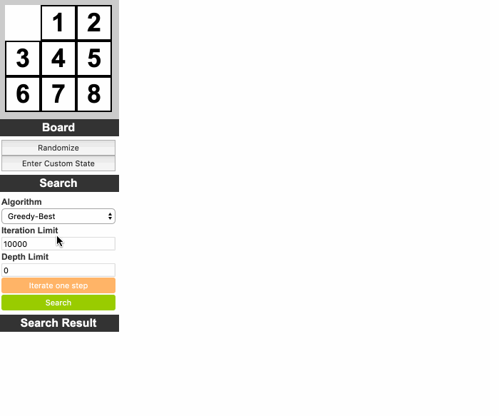

# 8-puzzle-solver

A web app that solves 8-puzzle game with various tree
search techniques. It also visualizes the search tree and supports one-step iterations to explore and comprehend search algorithms. My project report can be found on [here](https://drive.google.com/file/d/0B0RFeAd0sIc6clZleGRlc2VQNmM/view?usp=sharing&resourcekey=0-DDPwqNilAupxFMlwN_8PMQ).

Avaliable on: [https://deniz.co/8-puzzle-solver](https://deniz.co/8-puzzle-solver)

Supported search algorithms:
- Breadth First
- Uniform Cost
- Depth First
- Iterative Deepening
- Greedy Best
- A*

## Installation

1. Fork it!
2. Install dependencies: `npm install`
3. Open src/index.html file: `open src/index.html`

## Build

1. Build the project: `npm run build`
2. The output will be saved to `index.html` to root. Open it: `open index.html`
